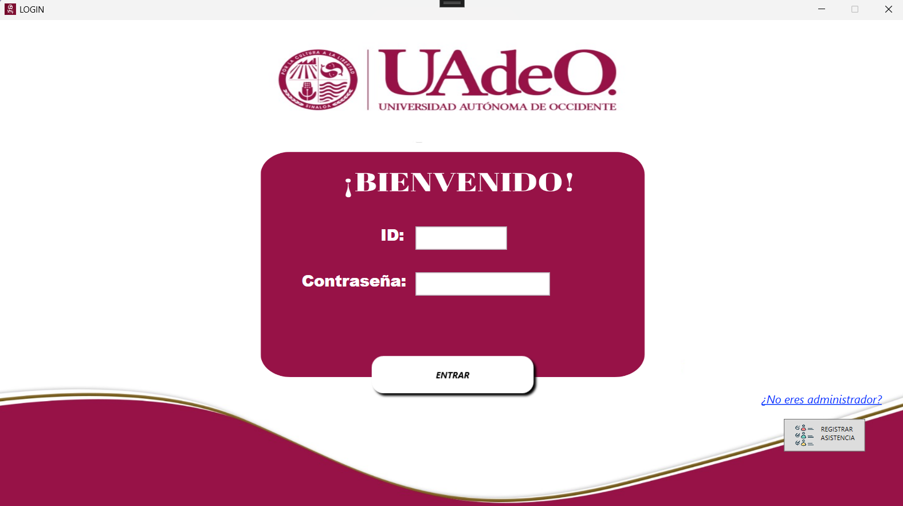
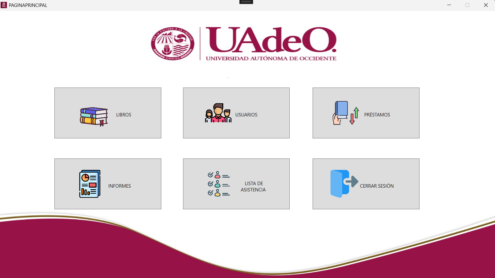
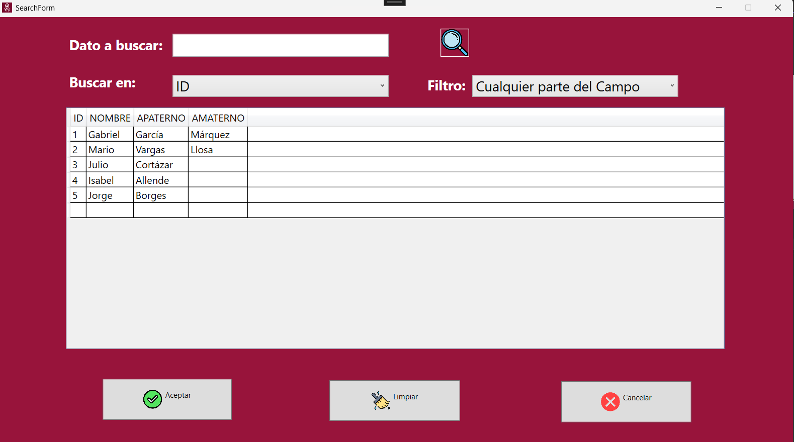
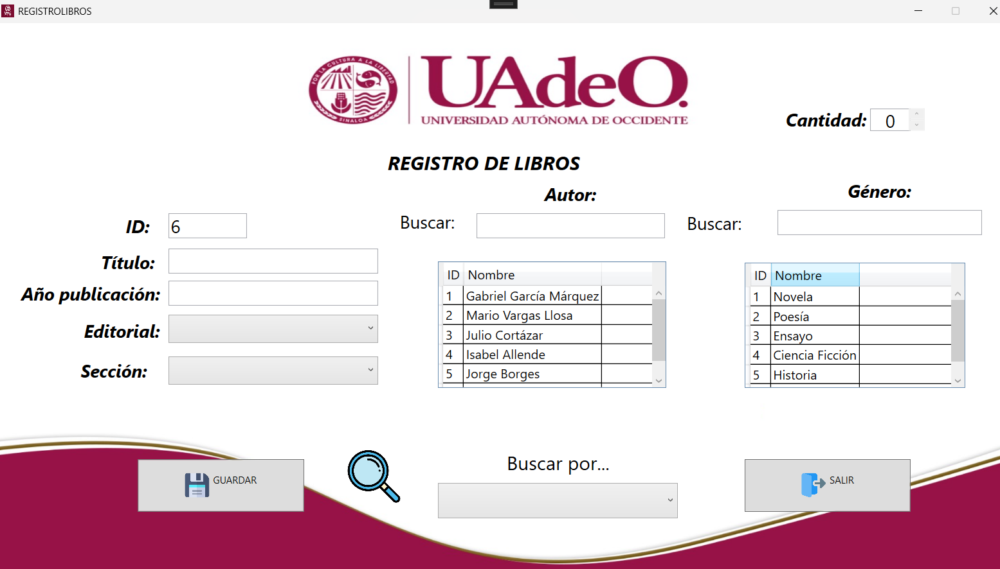
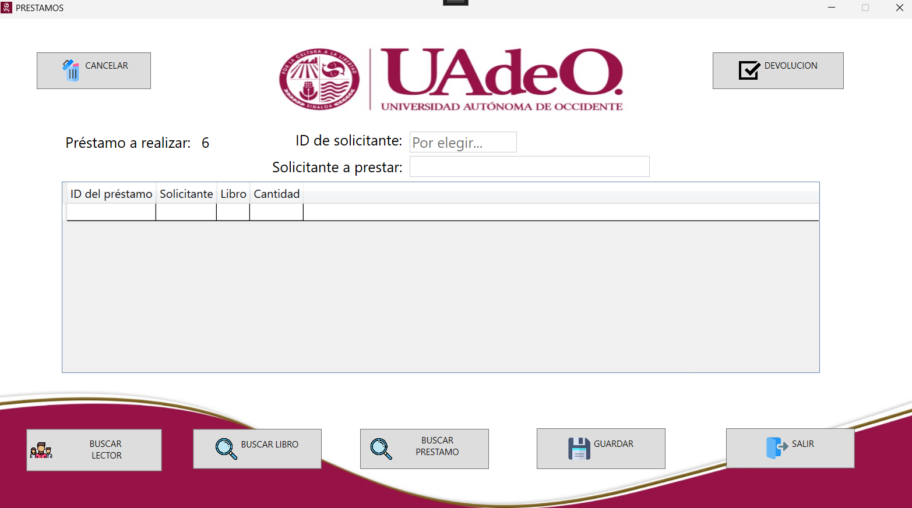
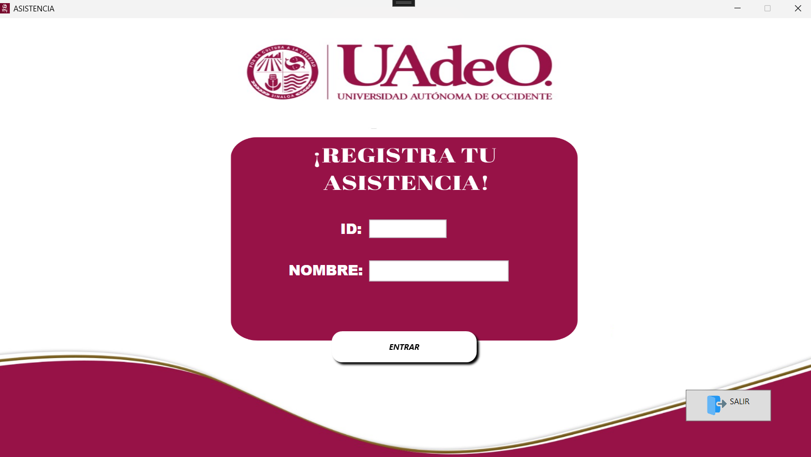

# Sistema de Biblioteca 📚

## 📌 Descripción
Sistema de biblioteca escolar desarrollado como proyecto académico usando C# y SQL.  
Este sistema permite gestionar el catálogo de libros de una biblioteca, incluyendo registro de usuarios, administradores y acciones relacionadas con préstamos y devoluciones de libros dentro de un entorno escolar.

---

## 🎯 Objetivo
El objetivo de este proyecto es aplicar conocimientos de programación orientada a objetos, arquitectura de software y manejo de bases de datos para construir un sistema funcional que automatice procesos comunes de una biblioteca.

Este sistema fue desarrollado como parte de actividades de la carrera de Ingeniería de Software para practicar desarrollo de aplicaciones de escritorio con lógica real y conexión a una base de datos.

---

## 🛠️ Tecnologías utilizadas
- **C#** – Desarrollo de la aplicación de escritorio  
- **WPF** – Interfaz gráfica de usuario (según proyecto)  
- **SQL Server** – Base de datos  
- **Visual Studio** – Entorno de desarrollo  
- **Git & GitHub** – Control de versiones

---

## 🧱 Estructura del proyecto
Este proyecto está organizado como una solución de Visual Studio que incluye:

---

## ⚙️ Funcionalidades principales
✔ Registro de usuarios del sistema  
✔ Gestión de catálogos de libros  
✔ Control de préstamos y devoluciones  
✔ Validación de datos de entrada  
✔ Conexión con base de datos SQL Server  

---

## 🗄️ Base de datos
La base de datos se maneja mediante SQL Server y se incluye un archivo de script (`BASE DE DATOS.sql`) que contiene todas las instrucciones necesarias para:

- Crear tablas
- Definir relaciones
- Insertar datos de prueba

> **Nota:** Para ejecutar el sistema correctamente, es necesario levantar la base de datos en tu instancia de SQL Server y configurar la cadena de conexión en el proyecto.

---

## 📸 Capturas del sistema

### 🔐 Inicio de sesión

### 🏠 Pantalla de inicio

### 🔎 Búsqueda de libros

### 📚 Gestión de libros

### 🔄 Préstamos

### 🧾 Asistencia / Registro

